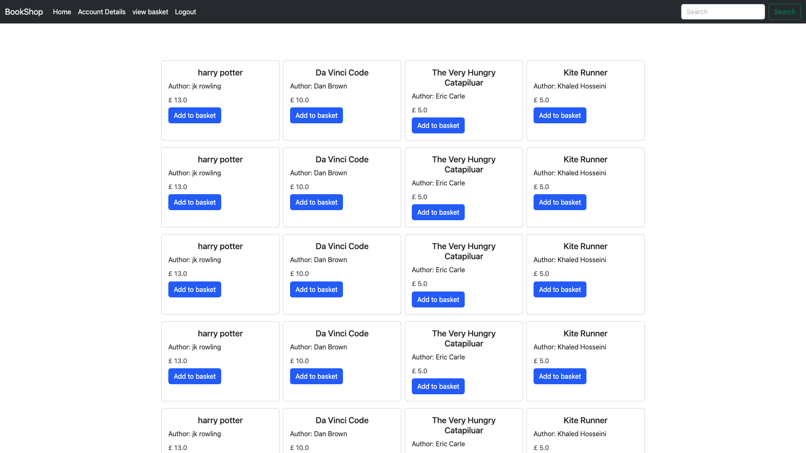
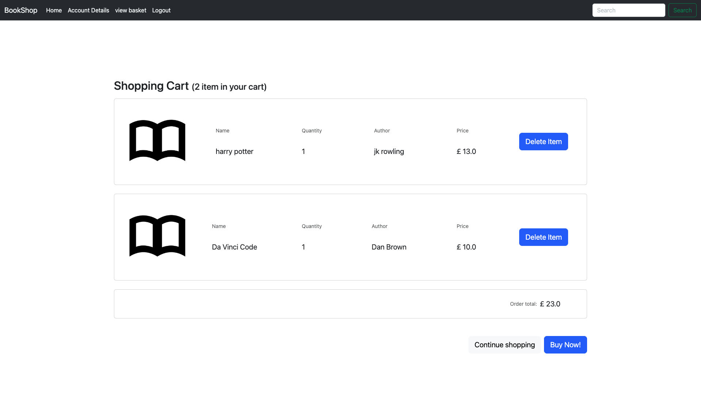
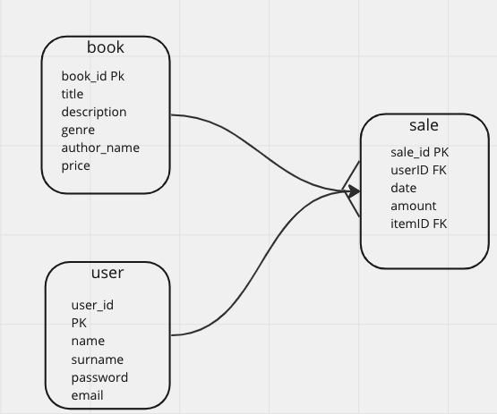
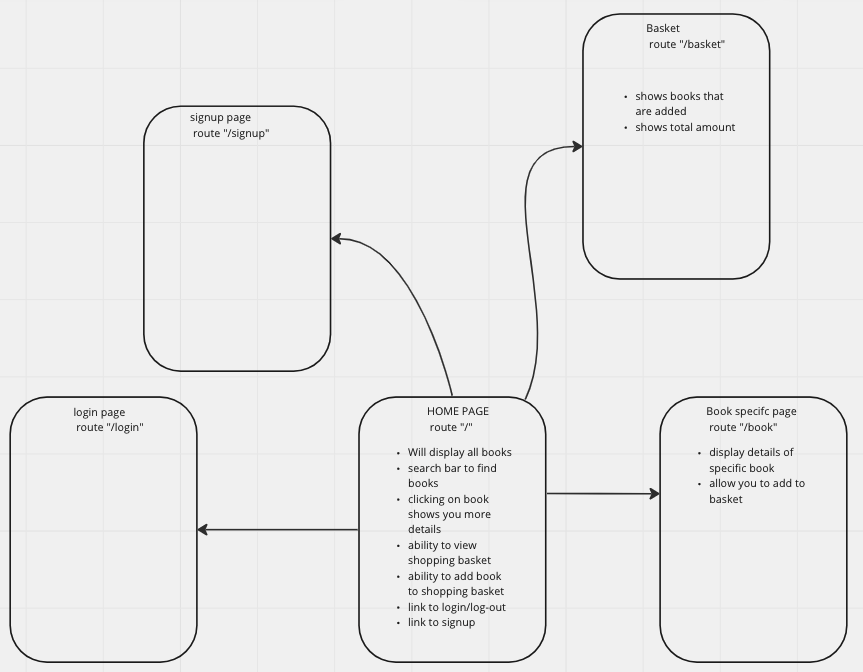

# Assessment #2 - BookShop

## Book StoreObjective

  The objective of this assessment is to build a Java webApplication using learning outcomes of Java modules based on a scenario.
  You  have been  asked  to  design  and  implement a 3-Tier based Java webApplication for a bookstore.

## Usage

- Must have Maven installed.
- I used Community Server Connection extension for vsCode to run the tomcat server that served the .WAR file.
- open a terminal.
- git clone <https://github.com/ruben-wilson/BookShop-java.git>.
- cd BSHOP.
-mvn compile.
- now run the "bshop-1.war" on a tomcat-9.0 server on Community Server Connection.

## Video Walk Through

[](<https://youtu.be/tXz1mgpxY24> "video walk through")

### index page

  
### index page - logged in


### Account page


### Shopping Cart



## Overview-Scenario and Design

   The application  will  be  made  available  for  two  user  groups:  Registered  User  and Unregistered  User.  Each  user  group  is  to  have  access  to  their  own  facilities  and  interlinked functionalities. Unregistered users can view Book Store/browse books but cannot access all the facilities and features compared to those a Registered User has.

### Facilities provided to the Unregistered User

- Ability to view list of books displayed by the application
- Ability to search Books
- Ability to read a specific book information (Overview, Authors, etc)
- Ability to add book to shopping basket
- Ability to view the shopping basket
- Ability to modify the shopping basket
- Ability to choose to proceed and checkout option
  
### Facilities provided to the Registered User

- Ability to access order history
- Ability to view personal account details
- Ability to modify account details such as firstname, lastname, email id and password
- Ability to purchase books
  
### Further details for an Unregistered and Registered Users
 An  Unregistered  User  can  view list  of books and just look and read  the basic book details provided. After that if the user is interested tthe user can register with Book Storeapplication.The registration process prompts the user to input all necessary details to register like firstname, lastname, email id and password etc. After registration, the user will have a unique email id and a password for logging in to theBook Store. Registered and Unregistered Users have a search option to search books by giving the name of the author(s) or the ISBN of the book. Registered Users can add books to shopping basket and purchase them.

## Database structure



### create statements

```sql
CREATE table Book(
  Book_ID INT NOT NULL AUTO_INCREMENT,
  Title VARCHAR(255),
  Description VARCHAR(255),
  Genre VARCHAR(20),
  Author VARCHAR(50),
  Price INT,
  PRIMARY KEY(Book_ID)
);

CREATE table User(
  User_ID INT NOT NULL AUTO_INCREMENT,
  Name VARCHAR(255),
  Username VARCHAR(255),
  Password VARCHAR(20),
  Email VARCHAR(50),
  PRIMARY KEY(User_ID)
);

CREATE table Sale(
  Sale_ID INT NOT NULL AUTO_INCREMENT,
  User_ID INT,
  Book_ID INT,
  Date VARCHAR(12),
  Amount FLOAT(10,2),
  PRIMARY KEY(Sale_ID),
  FOREIGN KEY (User_ID) REFERENCES User(User_ID),
  FOREIGN KEY (Book_ID) REFERENCES Book(Book_ID)
);
```

### seed data

```sql
INSERT INTO book(Title, Description, Genre, Author, Price)VALUES 
("harry potter", "its about a wizard", "fantasy", "jk rowling", 12.50),("Da Vinci Code", "Da Vinci Code is a book ...", "Thriller & Adventure", "Dan Brown", 9.50),("Very Hungry Caterpillar,The:The Very Hungry Caterpillar", "Very Hungry Caterpillar goes on an adventure", "picture book", "Eric Carle", 5.00),("Kite Runner", "a sad story", "literal fiction", "Khaled Hosseini", 5.00);

INSERT INTO user(Name, Username, Password, Email)VALUES 
("harry", "hp", "fantasyeee33", "hp@gmail.com"), ("daniel", "dannie", "fantafdsyeee33", "d@gmail.com"),("mike", "mk", "books123", "m@gmail.com");

INSERT INTO sale(User_ID, Book_ID, Date, Amount)VALUES
(6, 1, "12/5/23", 13.00), (6, 2, "12/5/23", 10.00), (6, 3, "12/5/23", 5.00);

-- join query for sales
SELECT u.Name, b.Title, b.Price, b.genre,
        b.Author, s.Date, s.Amount FROM 
        sale s 
        INNER JOIN book b ON s.Book_ID = b.Book_ID
        INNER JOIN user u ON s.User_ID = u.User_ID;
```

## website layout first draft



## SPRINT ONE

as a user
i should be able to see all books

as a user
i should be able to sign up

as a user
i should be able to
login/out

## SPRINT TWO

as a user
i should be able to search
for a book by title

as a user
i should be able to see a
specific books details
"information (Overview, Authors, etc)"

## SPRINT THREE

as a user
i should be able to add a book to shopping basket

as a user
i should be able to view my shopping basket

as a user
i should be able to modify my shopping basket

as a user
i should be able to procced to a checkout option

## SPRINT FOUR

(Back Log)
"as a user
i should be able to procced to a checkout option"

as a user
i would like to be able to see an account page

as a user
i would like to be able to
edit my acount details

as a user
i would like to see my order
history

## SPRINT FIVE

(use factory class and make db class static)

as a user
i would like to be able to
see my last ten orders on my profile page

as a user
in my basket i would like
to see total amount

as a user
i want to see my total orders

as a user
i want all pages nicely styled

as a user
i want my password encrypted
